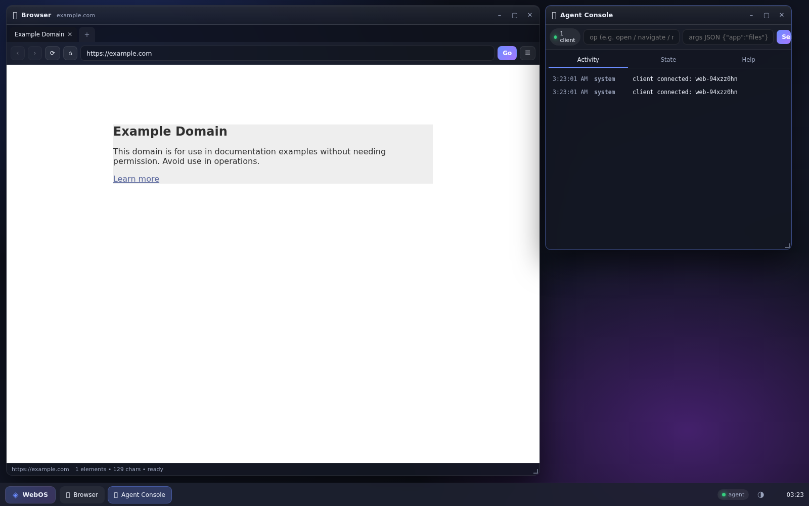

# ◈ WebOS — agent-operable browser OS

Ek **browser-based operating system** jo browser me chalta hai, lekin usko **agent (LLM / script / curl)**
poori tarah control kar sakta hai: windows kholna, files banana, shell chalana, real websites browse karna,
page padhna, buttons click karna, forms bharna.



```
┌───────────────────── browser tab (user dekhta hai) ─────────────────────┐
│  Desktop · Wallpaper · Taskbar · Start menu · Toasts                     │
│  Windows: 🌐 Browser · 📁 Files · 📝 Editor · ⌨️ Terminal · 🤖 Agent …   │
│                        ▲  SSE commands        │ POST results/state       │
└────────────────────────┼──────────────────────┼──────────────────────────┘
                         │                      ▼
             ┌───────────┴────────────────────────────────┐
             │ Node server (zero dependencies)            │
             │  agent bus · virtual FS · shell · web proxy│
             └───────────▲────────────────────────────────┘
                         │ HTTP (curl / LLM tool call)
                    🤖 external agent
```

---

## Chalane ka tarika

```bash
cd webos
node server.js          # http://localhost:3000
```

Koi dependency nahi chahiye — sirf Node 18+. Browser me `http://localhost:3000` kholo,
OS boot ho jayega (Browser + Agent Console windows ke saath).

## Apps

| App | Icon | Kya karta hai |
|---|---|---|
| **Browser** | 🌐 | Real internet browsing (server-side proxy), tabs, address bar, Elements/Text/Tools side panel, agent refs |
| **Files** | 📁 | Virtual filesystem — folders, rename, delete, download |
| **Editor** | 📝 | Text/Markdown editor, save/save-as, preview, download |
| **Terminal** | ⌨️ | `ls cd cat mkdir write touch rm cp mv tree find open browse read search agent notify …` |
| **Agent Console** | 🤖 | Live agent activity log + state viewer + manual op sender + full help |
| **Docs** | 📖 | Manual + shortcuts |
| **Calculator / Settings / Monitor / Music** | 🧮 ⚙️ 📊 🎵 | Utilities, themes, system info, WebAudio tones |

## Agent ko control kaise de

```bash
# 1. OS state padho (windows, browser page, elements, files)
curl -s localhost:3000/api/agent/state | jq

# 2. Website kholo
curl -s localhost:3000/api/agent/cmd -H 'content-type: application/json' \
  -d '{"op":"navigate","app":"browser","args":{"url":"https://news.ycombinator.com"},"wait":true}'

# 3. Page padho / links nikalo
curl -s localhost:3000/api/agent/cmd -H 'content-type: application/json' \
  -d '{"op":"read","args":{"mode":"elements"},"app":"browser"}'

# 4. Click / type karo
curl -s localhost:3000/api/agent/cmd -H 'content-type: application/json' \
  -d '{"op":"click","args":{"text":"Sign in"},"app":"browser"}'

# 5. Files likho, shell chalao
curl -s localhost:3000/api/exec -H 'content-type: application/json' \
  -d '{"cmd":"mkdir /Home/report && write /Home/report/r.md \"done\""}'
```

Search ke baare me: DuckDuckGo/Bing **datacenter IPs** (Render/Vercel) ko alag treat karte hain —
DDG bot-wall de deta hai. Isliye OS me multi-engine fallback hai jo cloud pe bhi kaam karta hai
(`GET /api/search?q=…` ke response me `engine` field dekho ki kaunsa chalа).

Ya ready-made CLI:

```bash
node tools/agent-cli.js state
node tools/agent-cli.js search "best laptops 2026"
node tools/agent-cli.js read text 4000
node tools/agent-cli.js click "Read more"
node tools/agent-cli.js type 0 "hello webos" --submit
node tools/agent-cli.js shell "ls /Home/Documents"
```

Poora reference: **[AGENT-API.md](AGENT-API.md)** (`/Home/Documents/agent-quickstart.md` bhi OS ke andar hai).

---

## Architecture (files)

```
webos/
├── server.js              HTTP server: static + API routing (no deps)
├── lib/
│   ├── vfs.js             virtual filesystem (data/fs.json me persist)
│   ├── shell.js           shell commands (ls/cd/cat/write/open/browse/read/search/agent…)
│   ├── proxy.js           web proxy: fetch → rewrite (base, resources, frame-busting) → bridge inject
│   └── agent.js           agent bus: SSE down, REST up, queue, long-poll, inbox fallback
├── public/
│   ├── index.html         boot screen + desktop
│   ├── css/os.css         desktop theme (dark/light, windows, widgets)
│   └── js/
│       ├── kernel.js      window manager, apps registry, toasts, prompts, state
│       ├── bridge.js      SSE client + result/state reporting + inbox fallback
│       └── apps/          browser.js · files.js · editor.js · terminal.js · agentapp.js · misc.js
├── tools/agent-cli.js     agent ke liye ready-made CLI
└── data/fs.json           persisted virtual filesystem
```

### Agent kaise GUI tak pahunchta hai

1. Agent → `POST /api/agent/cmd {op, app, args, wait:true}`
2. Server command ko us browser tab tak bhejta hai jo `/api/agent/stream` (SSE) pe connected hai
   **aur** saath hi `/api/agent/inbox` me rakh deta hai (agar platform SSE buffer kare to bhi kaam
   chale; GUI command id se dedupe karta hai).
3. GUI (kernel) op chalata hai — window kholna, browser navigate, click/type, editor me likhna…
4. GUI result + fresh OS state server ko POST karta hai → agent ko long-poll response mil jata hai.

### Browser proxy kaise kaam karta hai

* Page server pe fetch hota hai, `<base>` + resource URLs (`img/css/js/fonts`) proxy ke through rewrite hote hain
* Frame-busting scripts aur `X-Frame-Options`/CSP meta hataye jaate hain, phir ek **bridge script**
  inject hota hai jo:
  * har 3s me snapshot bhejta hai — URL, title, text, aur **saare interactive elements with stable refs**
  * link clicks intercept karta hai (navigation OS ke andar rehti hai, `target=_blank` → naya tab)
  * form submits ko GET/POST sahi URL pe bhejta hai
  * parent ke `click {ref}` / `type {ref,text}` / `scroll` / `eval` commands chalata hai

---

## Keyboard shortcuts

| Keys | Action |
|---|---|
| `Ctrl+Space` | Start menu |
| `Ctrl+K` | Browser address bar |
| `Ctrl+T` | New browser tab |
| `Ctrl+W` | Active window close |
| titlebar dbl-click | maximize / restore |

## Known limits (honest list)

* Kai sites apne full UI proxy me nahi de dengi (Google search, `X-Frame-Options: DENY` wali sites,
  heavy SPA anti-bot). Un ke liye `read` / `extract` (server-side text + links) use karo — wo hamesha chalta hai.
* Search engine stack (cloud IPs ke liye tuned): public SearXNG pool (paulgo.io, searxng.site, opnxng.com)
  → Marginalia API → Bing HTML → Bing RSS → Brave → DuckDuckGo → Wikipedia. Har engine ke results
  ek relevance filter se guzarte hain, isliye koi engine kachra (regional/trending feed) bheje to
  result reject ho kar next engine try hota hai. Instance cooldown + 3-min result cache bhi hai.
* Login/cookie wali sessions kaam karti hain (form POST proxy se jaate hain) lekin kuch sites
  JS-based auth (captcha) maangti hain — wo robot ke liye ruk jayegi.
